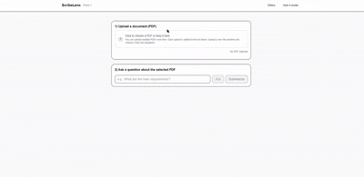

# ScribeLens 🔍

Your documents. Your rules. AI that respects privacy.




## ScribeLens

ScribeLens is my first Generative AI + Retrieval-Augmented Generation (RAG) app, built to provide private, document-focused Q&A without relying on third-party chatbots. Users can upload PDFs, which are converted into embeddings and stored in a local vector store. When questions are asked, the system retrieves the most relevant passages and generates accurate, context-aware answers always grounded in the uploaded docs. With a Next.js App Router backend, OpenAI embeddings, and zero external storage (files are never saved, and embeddings are deleted permanently on request), ScribeLens ensures both speed and privacy. This project taught me the foundations of RAG systems, vector search, and ethical AI development.

👉 **Live demo**: [https://scribe-lens.up.railway.app/](https://scribe-lens.up.railway.app/)  
📂 **Repo**: [github.com/Yasir-Rafique/scribe-lens](https://github.com/Yasir-Rafique/scribe-lens)

---

## ✨ Why ScribeLens

ScribeLens is built for **people who need fast, accurate answers from their own documents**
PhD students skimming research, lawyers reviewing contracts, teams searching specs, or students summarizing papers.

The focus is on **privacy, simplicity, and reliability** not being a one-size-fits-all chatbot.

---

## 🔑 Highlights

- 🔒 **Privacy-first** → PDFs are _not_ saved, only embeddings. Delete = permanent removal.
- ⚡ **VectorStore magic** → embeddings enable fast & accurate retrieval.
- ⚙️ **Next.js App Router** → clean API routes, server actions, streaming responses.
- 🧩 **Accurate retrieval** → embeddings + keyword fallback + small heuristics.
- 💬 **Natural answers** → grounded in your docs, concise, and reference snippets included.

---

## 🛠️ How it works (high level)

1. Upload a PDF.
2. Extract text → split into refined chunks.
3. Create embeddings with OpenAI.
4. Store embeddings in a local vector store (`./vector/<pdfId>.json`).
5. Query → embed the question → retrieve nearest chunks → pass context to LLM.
6. Answer is generated _only from your docs_ (no open web).

---

## 🚀 Features

- ✅ PDF upload & automatic chunking
- ✅ Embedding creation with OpenAI
- ✅ Local file-based vector store (MVP)
- ✅ Retrieval + Q&A with context snippets
- ✅ Keyword fallback & heuristics
- ✅ Document summarization fallback
- ✅ Front-matter boosting (title/author detection)
- ✅ Clean Next.js + Tailwind UI

---

## ⚡ Quickstart

### Requirements

- Node.js v18+
- OpenAI API key (`OPENAI_API_KEY`)

### Install

```bash
git clone https://github.com/Yasir-Rafique/scribe-lens.git
cd scribe-lens
npm install
```

### Environment

Create .env.local:

```bash
OPENAI_API_KEY=sk-...
```

### Run (dev)

```bash
npm run dev
http://localhost:3000
```

### Build / Production

```bash
npm run build
npm run start
```

## ⚙️ Design Choices

- Embedding model → text-embedding-3-small (normalized).
- Vector store → simple JSON per PDF (MVP).
- Retrieval logic → cosine similarity + keyword fallback + heuristics.
- LLM prompts → enforce context-only answers, concise replies, and reference listing.

## 🔒 Privacy & Ethics

- 🚫 PDFs are never stored. Only embeddings are created.
- 🗑️ Delete = permanent removal. We cannot access deleted embeddings.
- 🔍 Transparent: embeddings live in local JSON files.
- ✅ Ethical defaults: if answer not found, model politely says so (no hallucination).

⚠️ Note: Embeddings are local, but queries still call OpenAI’s API.
Swap in self-hosted LLMs/embedding models if you need full local inference.

## 🧰 Troubleshooting

- Dimension mismatch → re-upload PDF to regenerate embeddings.
- No text extracted → PDF may be scanned; run OCR first.
- Vague answers → system prompt enforces fallback message.

## 📜 License

MIT © 2025 Yasir Rafique

## 👤 Author

Muhammad Yasir Rafique
🌐 GitHub: @Yasir-Rafique
🚀 Live demo: https://scribe-lens.up.railway.app/

### ✨ Thanks for checking out ScribeLens - privacy-first RAG for people who care about accurate answers under their control. 🚀
